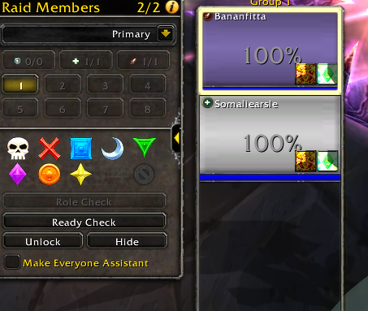
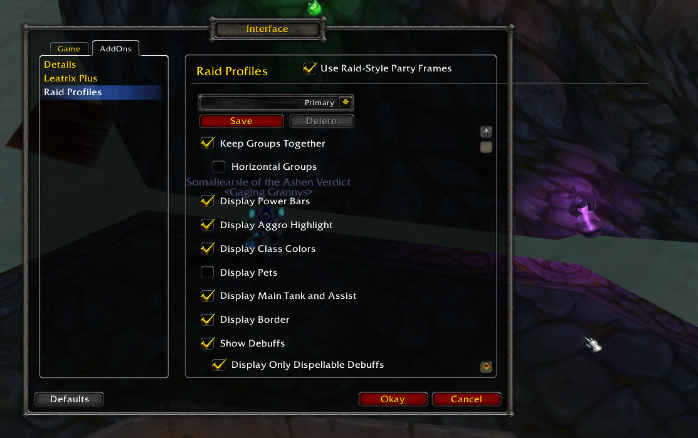

# Compact Raid Frames — stock 3.3.5a

Blizzard's **Compact Raid Frames** (the Cataclysm-era raid UI, packaged as an
addon by **Tsoukie**) backported to **stock World of Warcraft 3.3.5a / Wrath of
the Lich King** (build 12340, Lua 5.1, interface `30300`).

The upstream version required the separate **`!!!ClassicAPI`** addon for modern
retail API. **This backport removes that dependency** — it is fully self-contained
and runs on a plain 3.3.5a client.



## Features

- Compact party **and** raid unit frames (health, power, class colours, status text).
- Health-text modes, class colours, aggro highlight, role / main-tank-assist icons.
- **Buffs, dispellable debuffs**, and threat highlight via stock WotLK aura/threat API.
- **Heal prediction** (incoming heals, incl. HoTs) via LibHealComm-4.0 and
  **damage absorbs** (Power Word: Shield, etc.) via AbsorbsMonitor-1.0.
- Savable **profiles** with per-content auto-activation, plus the **Raid Members**
  manager panel (group/role filters, raid markers, ready check, lock/hide).
- Optional **raid-style party frames**.



## Installation

Copy the **`CompactRaidFrame`** folder (the addon, *not* the repo root) into your client:

```
<WoW 3.3.5a>\Interface\AddOns\CompactRaidFrame\
```

> The folder **must** be named `CompactRaidFrame` — the bundled texture paths are
> `Interface\AddOns\CompactRaidFrame\Texture\…`.

Restart the client (or `/reload`). Open the options via **Interface → AddOns →
Raid Profiles**, or the **ⓘ** button on the Raid Members panel.

## What changed vs. upstream

- **No ClassicAPI dependency.** Everything ClassicAPI provided is re-implemented in a
  first-loaded compatibility layer
  ([`WotLKCompat.lua`](CompactRaidFrame/WotLKCompat.lua)) — group API, role inference,
  range checks, `C_Timer`, `C_UIDropDownMenu_*`, `CopyTable`, `Mixin`,
  `SetSize`/`GetSize`, `SOUNDKIT`, and more — all additive and taint-safe.
- **Bundled artwork** under [`Texture/`](CompactRaidFrame/Texture) (was in ClassicAPI).
- **Native templates** ([`Templates.xml`](CompactRaidFrame/Templates.xml)) replacing the
  ClassicAPI-only `HorizontalSliderTemplate` / `UIMenuButtonStretchTemplate` /
  `UIPanelInfoButton` / `C_UIDropDownMenuTemplate`.
- **`GROUP_ROSTER_UPDATE` relay** ([`CRFEventRelay.lua`](CompactRaidFrame/CRFEventRelay.lua))
  — that event is MoP+, so roster changes are relayed from the real 3.3.5a events.
- **Heal prediction + absorbs** ([`CRFHealAbsorb.lua`](CompactRaidFrame/CRFHealAbsorb.lua)).
- Options panel reflowed to a **scrollable single column** to fit the smaller stock
  Interface Options container.

See [CHANGELOG.md](CHANGELOG.md) for the full list.

## Notes & limitations

- Heal prediction includes HoTs; LibHealComm-4.0 may show a HoT tick ~1 tick ahead of
  when it actually lands (an inherent 3.3.5a limitation).
- The manager's group/role filter buttons only appear in an actual raid (a party has
  no subgroups).

## Credits

- Original raid-frame system: **Blizzard Entertainment**
- Addon / packaging: **Tsoukie** — <https://gitlab.com/Tsoukie/compactraidframe-3.3.5>
- Bundled libraries: LibHealComm-4.0, AbsorbsMonitor-1.0, LibGroupTalents-1.0,
  LibResComm-1.0, Ace3, LibStub (their respective authors).
- Stock-3.3.5a (no-ClassicAPI) backport: **Jedborg**
